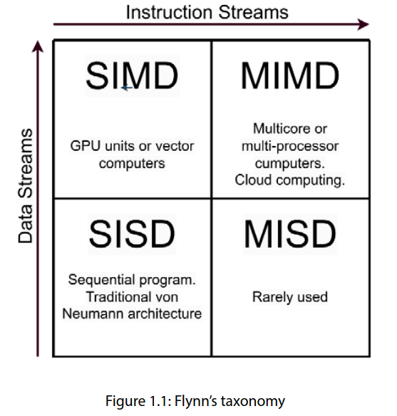
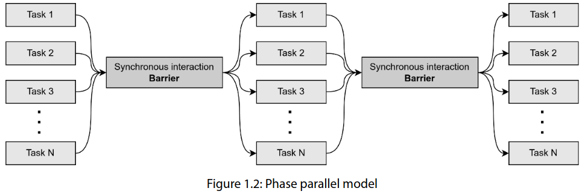
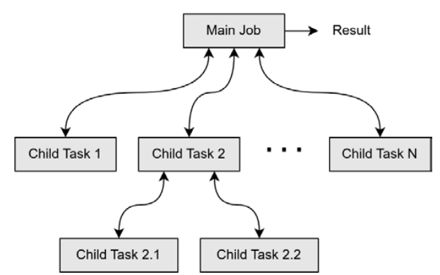
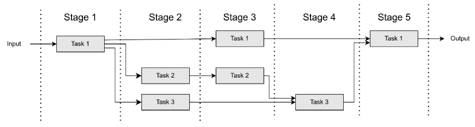
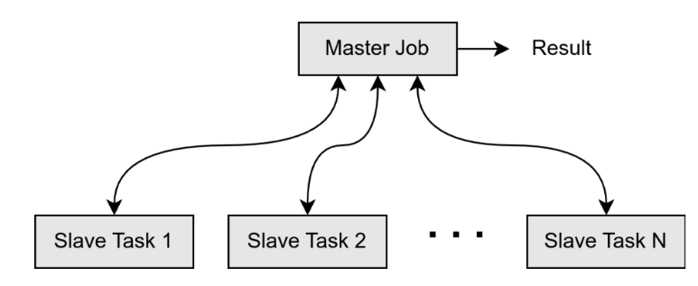
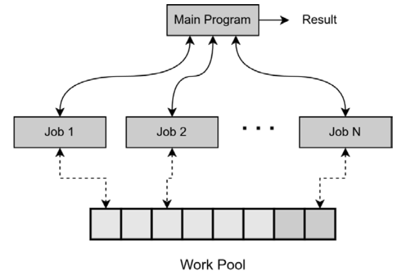
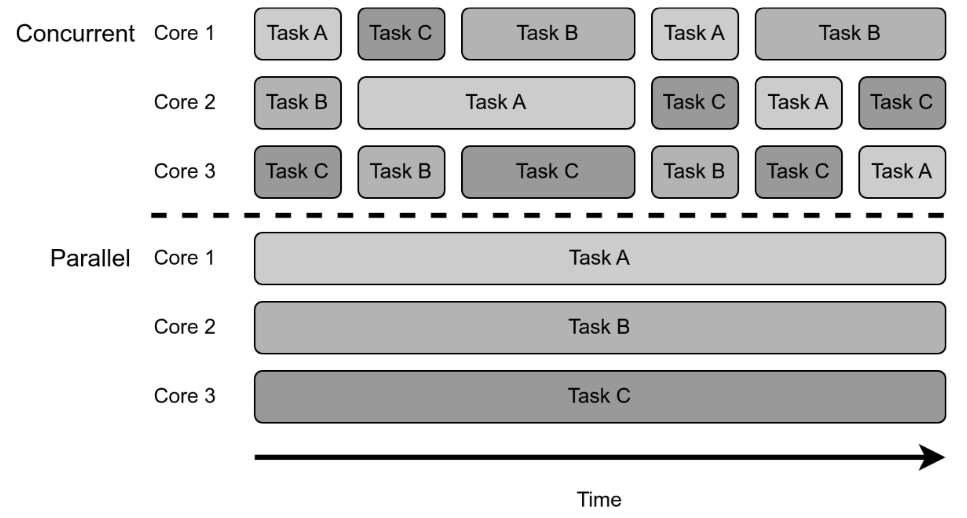

# Parallel Programming Paradigms

Parallel computing occurs when tasks or computations are done simultaneously, with a task being a unit of execution or unit of work in a software application.

## Systems classifications and techinques

- **Single-instruction-single-data (SISD) systems**: Define a sequential program
- **Single-instruction-multiple-data (SIMD) systems**: Where operations are done over a large
dataset, for example in signal processing of GPU computing
-  **Multiple-instructions-single-data (MISD) systems**: Rarely used
- **Multiple-instructions-multiple-data (MIMD) systems**: The most common parallel architectures
based in multicore and multi-processor computers

### Data parallelism

Data parallelism is achieved by how many disjoint datasets can be processed at the same time by the same operations. Large datasets can be divided into smaller and independent data chunk exploiting parallelism.

### Task parallelism

In computers where each CPU core runs different tasks using processes or threads, **task parallelism** can be achieved when these tasks simultaneously receive data, process it, and send back the results that they generate via message passing.

### Stream parallelism

A continuous sequence of data elements, also known as a data stream, can be processed concurrently by dividing the computation into various stages processing a subset of the data.

### Implicit parallelism

In this case, the compiler, the runtime, or the hardware takes care of parallelizing the execution of the instructions transparently for the programmer.

## Parallel programming models

A parallel programming model is a parallel computer’s architecture used to express algorithms and build programs. The more generic the model the more valuable it becomes, as it can be used in a broader range of scenarios.

- **Phase parallel**: In phase parallel, also known as the agenda or loosely synchronous paradigm, multiple jobs or tasks perform independent computations in parallel

- **Divide and Conquer**: The application using this model uses a main task or job that divides the workload among its children, assigning them to smaller tasks. Child tasks compute the results in parallel and return them to the parent task, where the partial results are merged into the final one. Child tasks can also subdivide the assigned task into even smaller ones and create their own child tasks.

- **Pipeline**: Several tasks are interconnected, building a virtual pipeline. In this pipeline, the various stages can run simultaneously, overlapping their execution when fed with data.

- **Master-slave**: Using the master-slave model, also known as process farm, a master job executes the sequential part of the algorithm and spawns and coordinates slave tasks that execute parallel operations in the workload. When a slave task finishes its computation, it informs the master job of the result, which might then send more data to the slave task to be processed.

- **Work pool**: In the work pool model, a global structure holds a pool of work items to do. Then, the main program creates jobs that fetch pieces of work from the pool to execute them. These jobs can generate more work units that are inserted into the work pool. The parallel program finishes its execution when all work units are completed and the pool is thus empty. 

## Parallel programming paradigms

### Synchronous programming 

A synchronous programming language is used to build programs where code is executed in a strict sequential order.

### Concurrent programming

Tasks can run independently without waiting for other tasks’ instructions to finish. They can also share resources and communicate with each other. Their instructions can run asynchronously, meaning that they can be executed in any order without affecting the outcome, adding the potential for parallel processing.

### Concurrency vs Parallelism

Concurrency happens when many execution paths can run in overlapping time periods with interleaved execution, while parallelism happens when these tasks are executed at the same time by different CPU units, exploiting available multicore resources.

Parallelism can exist without concurrency (without interleaved time periods) and concurrency without parallelism (by multitasking by time-sharing on a single-core CPU).

### Asynchronous programming

Asynchronous programming allows some tasks to be scheduled and run in the background while continuing to work on the current job without waiting for the scheduled tasks to finish. When these tasks are finished, they will report their results back to the main job or scheduler.

### Parallelism programming

With parallel programming, multiple computation tasks can be done simultaneously on multiple processing units, either with all of them in the same computer (multicore) or on multiple computers (cluster).

There are two main approaches:
- Shared-memory parallelism: Tasks can communicate via shared memory, a memory space
accessible by all processors
- Message-passing parallelism: Each task has its own memory space and uses message passing
techniques to communicate with others

### Multithreading programming 

Multithreading programming is a subset of parallel programming wherein a program is divided into multiple threads executing independent units within the same process. The process, memory space, and resources are shared between threads.

### Event driven programming 

In event-driven programming, the control flow is driven by external events. The application detects events in real time and responds to these by invoking the appropriate event-handling method or callback.

### Reactive programming 

Reactive programming deals with data streams, which are continuous flows of data or values over time. A program is usually built using declarative or functional programming, defining a pipeline of operators and transformations applied to the stream. These operations happen asynchronously using schedulers and backpressure handling mechanisms.

### Dataflow Programming

With dataflow programming, a program is designed as a directed graph of nodes representing computation units and edges representing the flow of data. A node only executes when there is some available data. This paradigm was invented by Jack Dennis at MIT in the 1960s.

## Metrics to assess parallelism

### Degree of parallelism

Degree of parallelism (DOP) is a metric that indicates the number of operations being simultaneously executed by a computer. It is useful to describe the performance of parallel programs and multi-processor systems.
